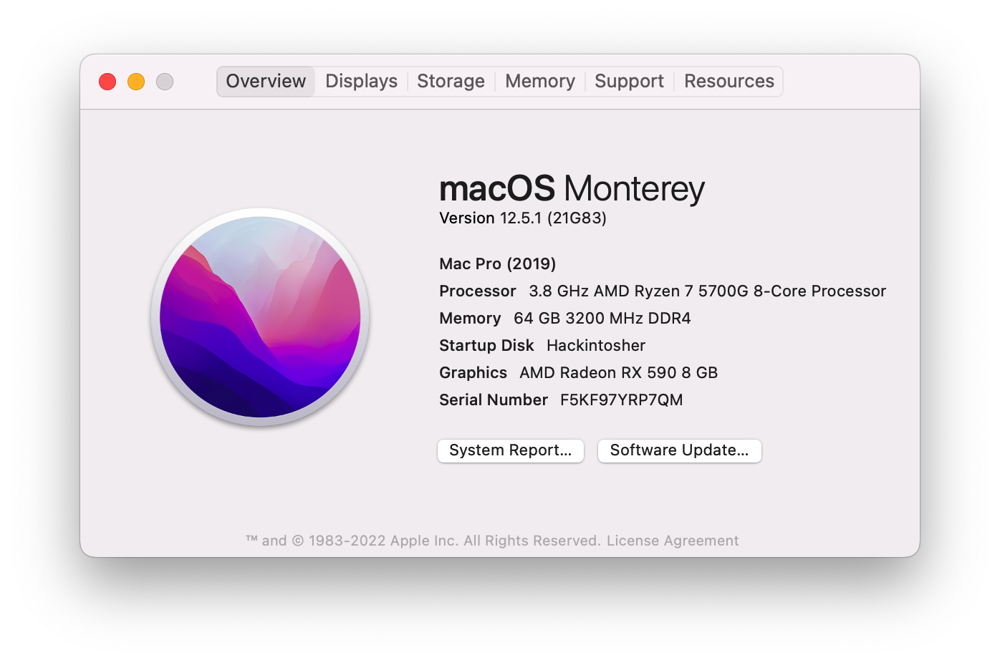
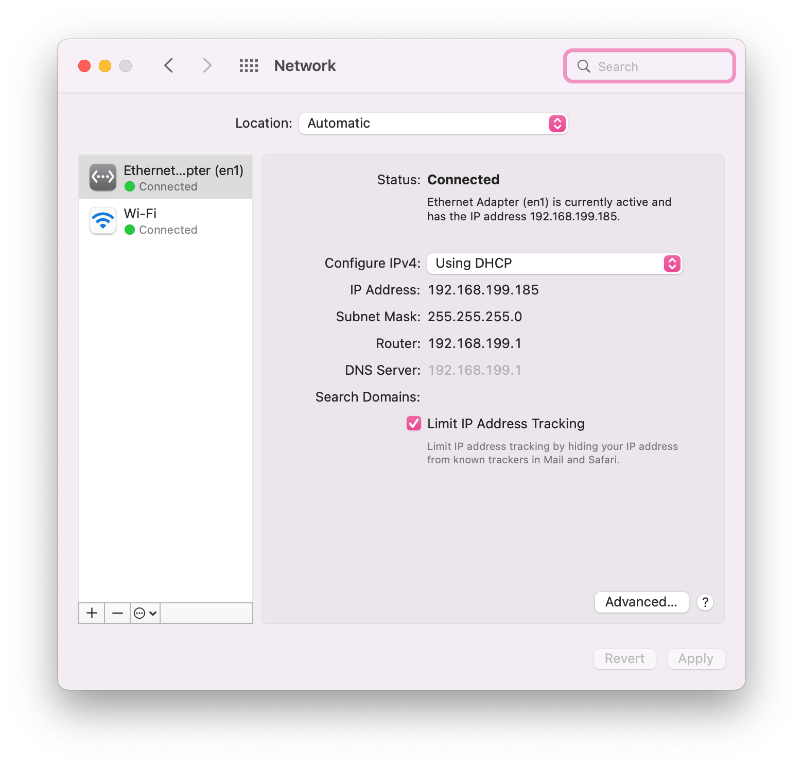
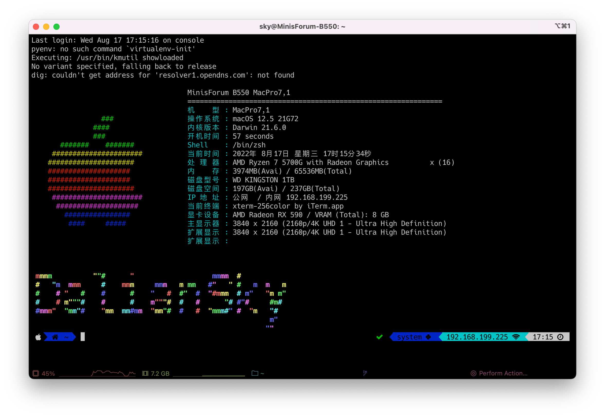

# minisforum-Elitemini-B550-Hackintosh

## 电脑配置

|   规格    |                           详细信息                           |
| :-------: | :----------------------------------------------------------: |
| 电脑型号  |                       minisforum Elitemini B550                        |
| 操作系统  | macOS `Ventura` /  `Monterey` / `Big Sur` / `Catalina` / `Mojave` |
|  处理器   |                 AMD 锐龙 R7-5700G 8核16线程                  |
|   内存    |                      32 GB DDR4 3200MHz                      |
|  硬盘1/2  | KINGSTON OM8PDP3512B-A01 512GB/ 支持双NVMe或NVMe+SATA SSD或双SATA SSD |
|  硬盘/3   |                    可接SATA 2.5寸硬盘/SSD                    |
|   核显    |                    Radeon Vega 8 Graphics                    |
|   独显    |                   AMD Radeon RX 590(选配)                    |
|  显示器   |                              无                              |
|   声卡    |                       USB Audio Device                       |
| 无线网卡  | m.2 NGFF插槽，默认出厂为 `Mediatek RZ608` 已更换为[BCM94360Z3](https://blog.daliansky.net/uploads/WeChatandShop.png) |
| 有线网卡1 |               Intel Ethernet Controller I225-V               |

## 更新日志

- 10-22-2022
  - 更新 `OpenCore` `v0.8.5`
  
- 9-14-2022
  - 更新 `OpenCore` `v0.8.4`
  - 更新 `SSDT-I225V` ，支持 `Ventura`

- 8-17-2022
  - 修复睡眠唤醒
  - 驱动`Intel I225-V`

